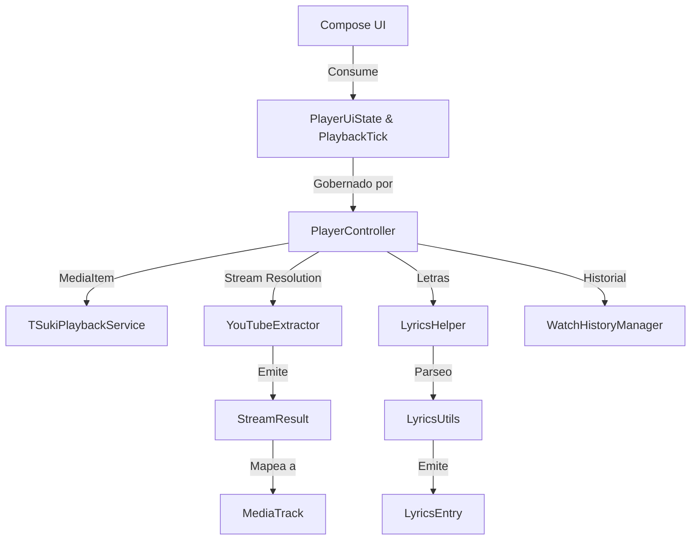

# 00.01 — Glosario Ubicuo y Mapa de Dependencias

> Ficha cerebro TSuki — fuente única de verdad para cualquier IA o ingeniero.
> Responde: QUÉ hace, PARA QUÉ, POR QUÉ está ahí, QUÉ NO TOCAR, CÓMO se trabaja.

---

## 1. QUÉ hace
Establece el vocabulario técnico canónico, los tipos de datos primordiales y la matriz de dependencias que conecta todos los subsistemas de TSuki. Define formalmente los siguientes términos:
- **`MediaTrack`** (`domain/model/MediaTrack.kt`): Entidad fundamental inmutable que representa una canción o video. Contiene `id` (11 caracteres de YouTube o hash local), `title`, `artist`, `album`, `durationMs`, `streamUrl`, `artworkUrl`, `isLocal`, `mediaType` (`STREAM_AUDIO`, `STREAM_VIDEO`, `LOCAL_AUDIO`) y `isVideoItem`.
- **`StreamResult`** (`network/YouTubeExtractor.kt`): Resultado de extracción con `audioUrl`, `videoUrl`, `title`, `thumbnailUrl`, `durationMs` y pistas de audio alternativas (`AudioTrackOption`).
- **`PlayerUiState`** (`playback/PlayerController.kt`): Estado inmutable emitido a la UI vía `StateFlow` que describe el track activo, cola, índices, modo de reproducción, estados de buffer y letras.
- **`PlaybackTick`** (`playback/PlayerController.kt`): Flujo de alta frecuencia (100-250ms) que emite exclusivamente la posición actual en milisegundos y duración, desacoplado de `PlayerUiState` para evitar recomposiciones masivas en Compose.
- **`RoomState`** (`together/TogetherMessages.kt`): Instantánea distribuida de una sala compartida en "Escuchar juntos" con `hostTime`, `queueHash`, `currentTrack` y permisos de invitados.
- **`LyricsEntry` / `WordTimestamp`** (`domain/model/LyricsEntry.kt`): Representación estructurada de letras sincronizadas con marcas silábicas de inicio y fin en milisegundos y segundos.
- **`TSukiBrain`** (`data/recommendation/TSukiModels.kt`): Perfil adaptativo local del usuario compuesto por vectores de afinidad temáticos, fatiga de repetición y decaimiento temporal.

**Archivos fuente clave:**
- [`domain/model/MediaTrack.kt`](file:///home/sebaxxfxz/Documentos/TSuki/app/src/main/java/com/example/tsuki/domain/model/MediaTrack.kt)
- [`domain/model/LyricsEntry.kt`](file:///home/sebaxxfxz/Documentos/TSuki/app/src/main/java/com/example/tsuki/domain/model/LyricsEntry.kt)
- [`playback/PlayerController.kt`](file:///home/sebaxxfxz/Documentos/TSuki/app/src/main/java/com/example/tsuki/playback/PlayerController.kt)
- [`together/TogetherMessages.kt`](file:///home/sebaxxfxz/Documentos/TSuki/app/src/main/java/com/example/tsuki/together/TogetherMessages.kt)

---

## 2. PARA QUÉ existe (problema que resuelve)
En proyectos con múltiples capas de red, streaming, persistencia local y sincronización distribuida, la ambigüedad en la nomenclatura (ej. llamar a un track indistintamente `song`, `video`, `item` o `media`) causa colisiones de claves, deserializaciones fallidas en red y desajustes de cache. Este glosario estandariza los nombres y tipos exactos para que ninguna IA o desarrollador invente alias inconsistentes.

---

## 3. POR QUÉ está en ese lugar (justificación de paquete)
Se ubica en `00 - Mapa Central` porque es transversal a los 12 módulos restantes. Es el primer archivo conceptual que una IA debe procesar antes de interactuar con el código fuente.

---

## 4. QUÉ NO SE DEBE TOCAR JAMÁS (zona roja)
- **`videoId` de 11 caracteres**: Los identificadores de YouTube DEBEN tener exactamente 11 caracteres alfanuméricos. `PlayerController` y `AutoQueueHelper` validan `id.length == 11` antes de consultar la API remota.
- **`customCacheKey` de MediaItem**: No alterar el formato `${track.id}_${quality}_vo` en `PlayerController.kt` ni `${mediaId}_audio` en `TSukiPlaybackService.kt`; una discrepancia rompe el cacheo en disco de ExoPlayer.
- **Distinción entre milisegundos y fracciones**: `playbackTick.positionMs` es en milisegundos absolutos, mientras que `M3WavySlider` consume obligatoriamente una fracción normalizada entre `0.0f` y `1.0f`.
- **`LyricsEntry.timestampMs` vs `WordTimestamp.startSeconds`**: Las líneas de letra miden su tiempo en milisegundos enteros (`Long`), pero las sílabas individuales dentro de la línea usan segundos decimales (`Float`).

---

## 5. CÓMO se ha estado trabajando aquí (convenciones reales)
- Lectura dirigida con `grep -n` sobre símbolos canónicos.
- En Kotlin: cero comentarios (`//` o `/** */`).
- Modificaciones con `oldString` mínimo y verificación mediante `./gradlew :app:compileDebugKotlin`.

---

## 6. Flujo y conexiones

- Enlaces del cerebro: [[01 - Vision General del Sistema]], [[01 - PlayerController Central]], [[01 - Invariantes Intocables y Quirks Criticos]].

---

## 7. Guía rápida para una IA nueva
1. Utiliza siempre los nombres de modelo tipados (`MediaTrack`, `LyricsEntry`).
2. Si creas una extensión de reproducción, canalízala exclusivamente a través de `PlayerController.getInstance(context)`.
3. Nunca agregues imports redundantes ni modifiques firmas públicas sin actualizar este glosario.
