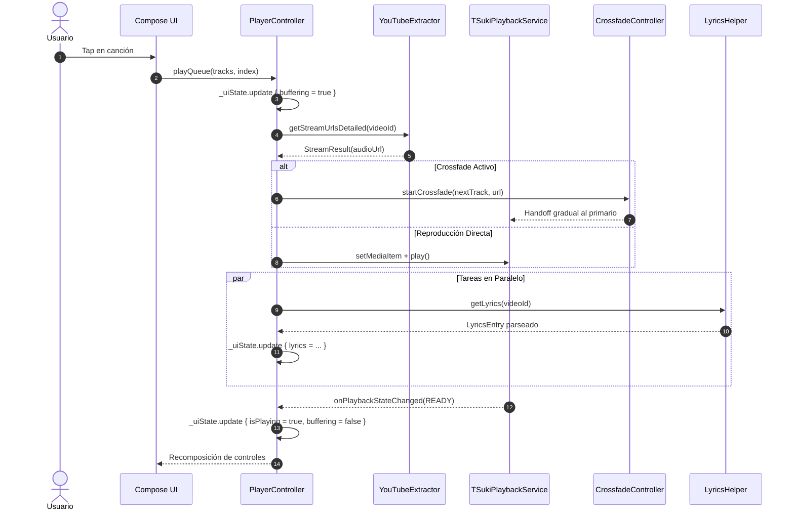

# 00.02 — Flujo de Datos End-to-End

> Ficha cerebro TSuki — fuente única de verdad para cualquier IA o ingeniero.
> Responde: QUÉ hace, PARA QUÉ, POR QUÉ está ahí, QUÉ NO TOCAR, CÓMO se trabaja.

---

## 1. QUÉ hace
Detalla la trayectoria completa de un evento en la aplicación desde que el usuario toca la pantalla hasta que el sonido sale por los altavoces o auriculares y se actualiza la interfaz visual:
1. **Disparo en UI**: El usuario pulsa una canción en `MusicScreen`, `LibraryScreen` o el buscador.
2. **Despacho a Controller**: Se invoca `PlayerController.playQueue(tracks, startIndex)`.
3. **Emisión de Estado Preliminar**: `PlayerController` actualiza inmediatamente `_uiState` con `isBuffering = true` y coloca el track en `currentTrack`.
4. **Resolución de Stream**: Se consulta `urlCache` (50 entradas). Si es miss, se llama a `YouTubeExtractor.getStreamUrlsDetailed(videoId)` en `Dispatchers.IO`.
5. **Inyección en MediaSession**: `PlayerController` construye un `MediaItem` con extras (`audio_stream_url`, `customCacheKey`) y lo envía al `MediaController`.
6. **Decodificación en Background**: `TSukiPlaybackService` recibe el `MediaItem`, lo canaliza por `PlayerCacheProvider` (SimpleCache LRU) e inicia la reproducción en `ExoPlayer`.
7. **Crossfade Opcional**: Si el crossfade está habilitado y la canción anterior estaba sonando, `CrossfadeController` inicia la pista entrante en un segundo `ExoPlayer` silenciado y ejecuta la curva de potencia constante `cos/sin` durante N segundos.
8. **Paralelos Asíncronos**:
   - `LyricsHelper` busca letras en 16 proveedores (priorizando TTML palabra por palabra).
   - `WatchHistoryManager` registra la escucha en `tsuki_history.db`.
   - `SponsorBlockClient` descarga los intervalos a omitir.
   - `ReturnYouTubeDislikeClient` obtiene la proporción de dislikes.
9. **Retorno a UI**: Los listeners de ExoPlayer notifican a `PlayerController`, actualizando `_uiState` (`isPlaying = true`, `isBuffering = false`). Compose recompone los botones y carátulas.

**Archivos fuente clave:**
- [`ui/player/MusicPlayerScreenV9.kt`](file:///home/sebaxxfxz/Documentos/TSuki/app/src/main/java/com/example/tsuki/ui/player/MusicPlayerScreenV9.kt)
- [`playback/PlayerController.kt`](file:///home/sebaxxfxz/Documentos/TSuki/app/src/main/java/com/example/tsuki/playback/PlayerController.kt)
- [`playback/TSukiPlaybackService.kt`](file:///home/sebaxxfxz/Documentos/TSuki/app/src/main/java/com/example/tsuki/playback/TSukiPlaybackService.kt)
- [`playback/CrossfadeController.kt`](file:///home/sebaxxfxz/Documentos/TSuki/app/src/main/java/com/example/tsuki/playback/CrossfadeController.kt)

---

## 2. PARA QUÉ existe (problema que resuelve)
Garantiza un Flujo Unidireccional de Datos (UDF) determinista y predecible. Evita estados inconsistentes como tener la barra de reproducción avanzando mientras ExoPlayer está pausado o congelado en buffering.

---

## 3. POR QUÉ está en ese lugar (justificación de paquete)
Pertenece a `00 - Mapa Central` porque documenta la orquestación inter-módulos (UI → Playback → Network → Data).

---

## 4. QUÉ NO SE DEBE TOCAR JAMÁS (zona roja)
- **`playGeneration`**: Entero incremental en `PlayerController` que invalida respuestas de red desfasadas si el usuario pulsa "Siguiente" repetidamente. Nunca omitir la verificación de `generation == currentGeneration`.
- **Desacoplamiento de `PlaybackTick`**: Nunca mezclar la emisión de milisegundos continuos dentro de `PlayerUiState`. Causaría recomposiciones globales a 10 FPS en toda la pantalla de Compose.

---

## 5. CÓMO se ha estado trabajando aquí (convenciones reales)
- Toda invocación de reproducción pasa por `PlayerController.playQueue` o `PlayerController.playTrackNow`.
- Nunca interactuar directamente con `MediaController` desde un Composable.

---

## 6. Flujo y conexiones

- Enlaces del cerebro: [[01 - PlayerController Central]], [[02 - Dual-ExoPlayer Crossfade y Handoff]], [[01 - Orquestador y 16 Proveedores]].

---

## 7. Guía rápida para una IA nueva
- Para rastrear fallos de reproducción, revisa secuencialmente: 1) `urlCache` en `PlayerController`, 2) logs de `YouTubeExtractor`, 3) estado de `MediaLibrarySession` en `TSukiPlaybackService`.
