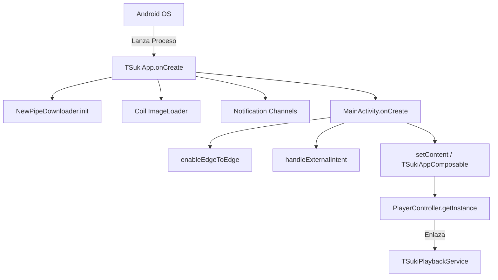

# 00.04 — Entry Points y Grafo de Arranque

> Ficha cerebro TSuki — fuente única de verdad para cualquier IA o ingeniero.
> Responde: QUÉ hace, PARA QUÉ, POR QUÉ está ahí, QUÉ NO TOCAR, CÓMO se trabaja.

---

## 1. QUÉ hace
Documenta el proceso de arranque en frío (*Cold Start*) de la aplicación:
1. **`TSukiApp.onCreate()`**:
   - Inicializa `NewPipeExtractor` configurando `NewPipeDownloader` con OkHttp y compresión Brotli.
   - Configura el singleton de `ImageLoader` de Coil 3 (`crossfade(true)`, cache en memoria y disco, `allowHardware(false)` para soporte Palette).
   - Crea canales de notificación en Android O+ (`tsuki_playback_channel`, `tsuki_download_channel`, `tsuki_new_videos`).
2. **`MainActivity.onCreate()`**:
   - Habilita `enableEdgeToEdge()` para dibujo bajo las barras del sistema.
   - Procesa Intents entrantes (`handleExternalYouTubeIntent`, deep links `tsuki://together`, archivos de audio compartidos).
   - Levanta el árbol de navegación Compose con `TSukiTheme`.
   - Inicializa el contenedor `PlayerBottomSheet` con los anclajes Dismissed, Collapsed (MiniPlayer) y Expanded (FullPlayer).
3. **`TSukiPlaybackService.onCreate()`**:
   - Inicializado de forma perezosa (*lazy*) al conectarse el `MediaController` desde `PlayerController`.
   - Inicializa `ExoPlayer` con `DefaultLoadControl` (buffer de 15s hacia atrás).
   - Adquiere `WakeLock` parcial para streaming continuo con pantalla apagada.

**Archivos fuente clave:**
- [`TSukiApp.kt:L18-65`](file:///home/sebaxxfxz/Documentos/TSuki/app/src/main/java/com/example/tsuki/TSukiApp.kt#L18-L65)
- [`MainActivity.kt:L78-310`](file:///home/sebaxxfxz/Documentos/TSuki/app/src/main/java/com/example/tsuki/MainActivity.kt#L78-L310)
- [`playback/TSukiPlaybackService.kt:L36-120`](file:///home/sebaxxfxz/Documentos/TSuki/app/src/main/java/com/example/tsuki/playback/TSukiPlaybackService.kt#L36-L120)

---

## 2. PARA QUÉ existe (problema que resuelve)
Explica la secuencia estricta de dependencias en arranque para evitar excepciones `UninitializedPropertyAccessException`, crashes por llamadas a `NewPipeExtractor` antes de setear el `Downloader`, o llamadas a `MediaController` antes de enlazar el servicio.

---

## 3. POR QUÉ está en ese lugar (justificación de paquete)
Pertenece a `00 - Mapa Central` al describir el ciclo de vida del proceso Android.

---

## 4. QUÉ NO SE DEBE TOCAR JAMÁS (zona roja)
- **Coil `allowHardware(false)`**: En `PlayerColorExtractor.kt:34` y en requests de carátulas para Palette. Extraer colores de un `HardwareBitmap` produce un crash fatal en Android.
- **`NewPipeDownloader.init(NewPipeDownloader)`**: Debe ejecutarse en `TSukiApp.onCreate()` antes de cualquier consulta de stream o canal.

---

## 5. CÓMO se ha estado trabajando aquí (convenciones reales)
- Arranques sin bloquear el hilo principal.
- Tareas pesadas diferidas con `Dispatchers.IO`.

---

## 6. Flujo y conexiones

- Enlaces del cerebro: [[01 - Vision General del Sistema]], [[07 - Manifiesto Android y Servicios]], [[01 - PlayerController Central]].

---

## 7. Guía rápida para una IA nueva
- Si necesitas inicializar un SDK global, hazlo en `TSukiApp.onCreate()`, nunca en una Activity o Composable.
