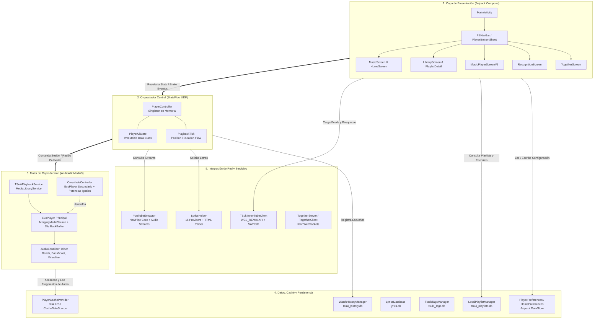

# 01 - Visión General de Arquitectura

> TSuki está diseñada bajo una arquitectura modular y pragmática, orientada a eventos unidireccionales (UDF - *Unidirectional Data Flow*), con un desacoplamiento estricto entre la interfaz de usuario de Jetpack Compose, el subsistema de reproducción Media3 en segundo plano, el cliente de red resiliente y la persistencia local en SQLite.

---

## 🏗️ Capas de la Aplicación

---

## 🔄 Flujo Unidireccional de Datos (UDF)

La arquitectura de reproducción de TSuki se fundamenta en la previsibilidad de estados inmutables:

1. **El Usuario Interactúa**: El usuario toca una pista en `MusicScreen` o pulsa reproducir en `MusicPlayerScreenV9`.
2. **Emisión de Intención**: La UI invoca un método de alto nivel en `PlayerController` (ej. `playQueue(tracks, startIndex)`).
3. **Resolución Asíncrona**:
   - `PlayerController` actualiza inmediatamente `_uiState` con `isBuffering = true` y los datos preliminares del track.
   - En paralelo, solicita la URL final de streaming a través de `YouTubeExtractor.getStreamUrlsDetailed(videoId)` (o lee la caché en memoria `urlCache`).
4. **Carga en el Servicio**: Con la URL obtenida, `PlayerController` crea un `MediaItem` inyectando metadatos en sus `extras` y lo despacha al `MediaController`.
5. **Buffer y Reproducción**: `TSukiPlaybackService` toma el `MediaItem`, lo canaliza por el `CacheDataSource` de `PlayerCacheProvider` y empieza la decodificación en `ExoPlayer`.
6. **Propagación del Estado**: Los listeners de ExoPlayer en el servicio informan de vuelta a `MediaController`. `PlayerController` escucha estos eventos y actualiza `PlayerUiState` (`isPlaying = true`, `isBuffering = false`).
7. **Recomposición Eficiente**: La UI observa `PlayerController.uiState` con `collectAsStateWithLifecycle()` y recombona únicamente las piezas visuales afectadas (carátula, botones, deslizador).

---

## 📦 Separación de Responsabilidades por Directorio

| Directorio | Propósito y Naturaleza |
| :--- | :--- |
| `ui/` | Pantallas puramente declarativas en Jetpack Compose, componentes reutilizables, temas de color y widgets Glance. No debe contener lógica de negocio ni llamadas directas de red bloqueantes. |
| `playback/` | El núcleo del audio: ciclo de vida de ExoPlayer, transiciones entre pistas, ecualización y servicio en primer plano. |
| `network/` | Clientes HTTP que interactúan con YouTube, YouTube Music, SponsorBlock y servicios de terceros. Serialización y deserialización JSON con `kotlinx.serialization`. |
| `lyrics/` | Gestión de proveedores de letras sincronizadas, parseo de formatos LRC y TTML, y resolución fonética silábica. |
| `data/` | Repositorios, persistencia en bases de datos SQLite nativas, DataStore de preferencias, exportación de backups y motor neuronal de recomendación local. |
| `domain/` | Clases de datos puras de dominio (`MediaTrack`, `LyricsEntry`) libres de dependencias de Android framework. |
| `together/` | Módulo de sincronización en tiempo real "Escuchar juntos", servidor HTTP/WebSocket CIO embebido en el dispositivo y sincronización de reloj. |
| `shazam/` | Implementación nativa del algoritmo de reconocimiento musical acústico mediante transformada rápida de Fourier (FFT) y picos de espectrograma. |
| `playlistimport/`| Parsers de listas de reproducción de Spotify, archivos M3U, CSV y backups ZIP de ArchiveTune con algoritmo de coincidencia difusa. |
