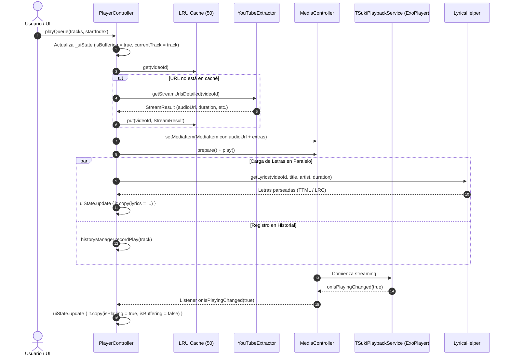

# 01 - PlayerController Central (Cerebro del Reproductor)

> **Ubicación:** `app/src/main/java/com/example/tsuki/playback/PlayerController.kt`
> **Tipo:** Singleton en memoria (`PlayerController.getInstance(context)`)
> **Dependencias clave:** `MediaController` (Media3), `CrossfadeController`, `AutoQueueHelper`, `YouTubeExtractor`, `LyricsHelper`, `WatchHistoryManager`, `AudioEqualizerHelper`.

---

## 🎯 Propósito y Filosofía de Diseño

`PlayerController` es la **única fuente de verdad** (*Single Source of Truth*) para todo lo relacionado con la reproducción en TSuki. Su existencia obedece a un principio fundamental: **la interfaz de usuario de Jetpack Compose jamás debe interactuar directamente con ExoPlayer ni con el servicio en segundo plano**.

En su lugar, la UI interactúa exclusivamente con `PlayerController` mediante:
1. Métodos de intención de alto nivel: `playTrack()`, `playQueue()`, `seekTo()`, `togglePlayPause()`, `playNext()`, etc.
2. Observación pasiva y reactiva de su `StateFlow<PlayerUiState>` (`uiState`) y `StateFlow<PlaybackTick>` (`playbackTick`).

---

## 📊 Anatomía de `PlayerUiState`

El estado de la UI es inmutable y está anotado con `@Immutable` para que Compose omita recomposiciones innecesarias en nodos no afectados:

```kotlin
@Immutable
data class PlayerUiState(
    val currentTrack: MediaTrack? = null,
    val isPlaying: Boolean = false,
    val isBuffering: Boolean = false,
    val errorMessage: String? = null,
    val playerMode: PlayerMode = PlayerMode.MiniPlayer,
    val videoStreamUrl: String? = null,
    val queue: List<MediaTrack> = emptyList(),
    val queueIndex: Int = 0,
    val shuffleEnabled: Boolean = false,
    val repeatMode: Int = Player.REPEAT_MODE_OFF,
    val dislikesData: RydVoteData? = null,
    val sponsorSegments: List<Pair<Long, Long>> = emptyList(),
    val availableQualities: List<QualityOption> = emptyList(),
    val selectedQuality: String = "Auto",
    val availableAudioTracks: List<AudioTrackOption> = emptyList(),
    val selectedAudioTrack: String? = null,
    val lyrics: List<LyricsEntry> = emptyList(),
    val isLyricsLoading: Boolean = false,
    val lyricsRaw: String? = null,
    val sleepTimerActive: Boolean = false,
    val sleepTimerRemainingMs: Long = 0L,
    val playbackSpeed: Float = 1.0f,
    val audioQualityLabel: String? = null,
    val crossfadeEnabled: Boolean = false,
    val crossfadeDurationSeconds: Float = 5f,
    val lyricsProvider: String = "Auto"
)
```

---

## 🔄 Ciclo de Vida de Resolución de una Pista



---

## ⚡ Manejo de Fallos y Reintentos Inteligentes

Para lidiar con cortes de red, tokens de streaming expirados (*HTTP 403 Forbidden*) o páginas recargadas de YouTube:
- `urlCache`: Almacena hasta 50 instancias de `StreamResult` resueltas recientemente.
- `MAX_RETRY_PER_SONG = 4`: Si ocurre un error de red o timeout, se programa un reintento con backoff exponencial (`BASE_RETRY_MS = 2000L` hasta un máximo de `15000L`).
- **Limpieza de Caché Forzada**: Si el error es un código HTTP 403 (URL de stream caducada), el reintento borra de inmediato la URL en caché y fuerza a `YouTubeExtractor` a solicitar una nueva URL fresca.
- **Salto Defensivo**: Si tras 4 intentos la canción no responde, `handleFinalFailure()` emite una notificación discreta y salta automáticamente a la siguiente pista de la cola (`playNext()`).

---

## 🛡️ SponsorBlock y Salto de Dislikes

`PlayerController` incluye dos integraciones comunitarias que elevan la calidad del streaming:
1. **SponsorBlock**: Consulta los segmentos de video catalogados por la comunidad. Durante el pulso de progreso (`startProgressTracker()`), si la posición actual entra en un intervalo de patrocinio o intro no musical, el reproductor ejecuta automáticamente un `seekTo(segment.second + 50L)`.
2. **Return YouTube Dislike (RYD)**: Recupera el ratio de aprobación de la canción, actualizando el estado `dislikesData` para que la UI pueda mostrarlo en los detalles del video.

---

## ⚠️ Lo que NO se debe tocar en este archivo

1. **El bucle `startProgressTracker()`**: Emite `_playbackTick` cada 100-250ms. Nunca agregues operaciones bloqueantes de I/O dentro de este bucle; cualquier demora congelará la animación de la barra de progreso en Compose.
2. **El cálculo de `playGeneration`**: Garantiza que si el usuario pulsa rápidamente "Siguiente" varias veces seguidas, las peticiones asíncronas anteriores queden invalidadas y no sobreescriban la pista final elegida.
3. **El hook con `CrossfadeController`**: `PlayerController` actúa como `Host` del crossfade. Las funciones `resolveAudioUrl`, `crossfadeNextTrack` y `loadNextOnPrimarySilently` forman el contrato sagrado de la mezcla continua.
