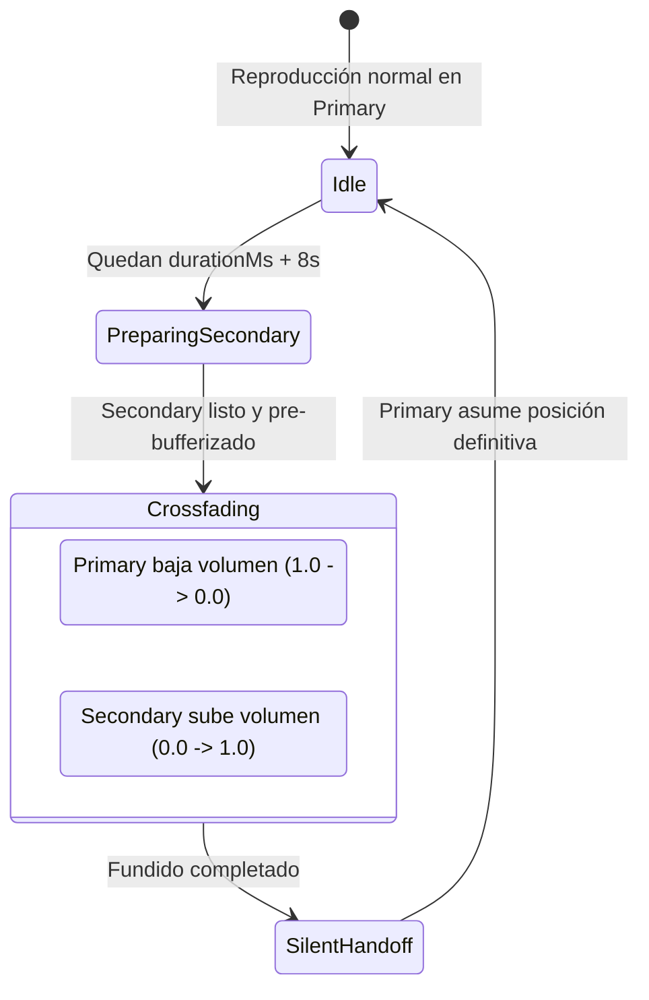

# 02 - Motor de Crossfade Real con Doble ExoPlayer

> **Ubicación:** `app/src/main/java/com/example/tsuki/playback/CrossfadeController.kt` y `CrossfadeHandoffPolicy.kt`
> **Propósito:** Fundido sonoro continuo y profesional entre canciones sin silencios ni cortes de buffer.

---

## 🎧 El Problema del Crossfade en ExoPlayer

ExoPlayer está diseñado como un motor de reproducción lineal: reproduce un `MediaItem`, descarga el siguiente y salta de forma continua (*gapless*). Sin embargo, **ExoPlayer no soporta decodificar y mezclar dos archivos de audio simultáneamente dentro de la misma instancia** para hacer un fundido cruzado (*crossfade*).

Intentar forzar crossfade con un solo reproductor cambiando el volumen al final de la canción produce un silencio abrupto mientras el segundo archivo inicializa su codec y buffer de red.

---

## 💡 La Solución TSuki: Arquitectura Dual-ExoPlayer

TSuki implementa un motor de dos capas coordinado por `CrossfadeController`:

### 1. Actores Involucrados
* **`primary` (`MediaController`):** El reproductor principal gobernado por el servicio `TSukiPlaybackService`. Es el que tiene el foco de audio del sistema, la notificación en pantalla de bloqueo y el control de widgets.
* **`secondary` (`ExoPlayer` autónomo):** Una instancia ligera de ExoPlayer creada bajo demanda exclusivamente dentro del proceso de la app.
* **`Host`:** Interfaz implementada por `PlayerController` que permite al controlador de crossfade pedir la siguiente pista (`crossfadeNextTrack`), resolver su URL de stream y ejecutar el traspaso silencioso (`loadNextOnPrimarySilently`).

---

## 📐 Matemática Acústica: Ley de Potencias Iguales

Si disminuyes el volumen de la pista saliente linealmente ($1 - t$) y aumentas el de la entrante ($t$), la percepción del oído humano experimenta una **caída de volumen perceptible en el punto medio** (a $t=0.5$, el volumen cae 3dB).

TSuki implementa la **Ley de Potencias Iguales (*Equal-Power Crossfade*)** en `CrossfadeHandoffPolicy.kt`:

$$	ext{ángulo} = progress 	imes rac{\pi}{2}$$
$$	ext{outgoing} = \cos(	ext{ángulo})$$
$$	ext{incoming} = \sin(	ext{ángulo})$$

De esta manera, la suma de las potencias cuadráticas se mantiene constante en todo momento:
$$\cos^2(	ext{ángulo}) + \sin^2(	ext{ángulo}) = 1.0$$

El resultado es un nivel de presión sonora constante, sin baches ni sobrecargas.

---

## 🔄 El Traspaso Silencioso (*Silent Handoff*)

Cuando el fundido termina (el secundario está al 100% de volumen y el primario al 0%), debe transferirse la responsabilidad al primario para que la notificación del sistema y la carátula se actualicen:

1. `CrossfadeController` marca `handingOff = true`.
2. Se toma la posición actual exacta del secundario (`secondary.currentPosition`).
3. Se invoca `host.loadNextOnPrimarySilently(track, startPositionMs)`.
4. El primario se inicializa con `startMuted = true` en esa posición exacta.
5. Se verifica que la deriva entre ambos reproductores no supere los 75ms (`MAX_ALLOWED_DRIFT_MS`).
6. Se destruye y libera el reproductor secundario (`cleanupSecondary()`), restaurando el volumen del primario a 1.0f de golpe.
7. Se apaga `handingOff = false`.

---

## 🚫 Detección Gapless Inteligente

Si dos canciones consecutivas pertenecen al **mismo álbum** (verificado mediante `current.album == next.album`), `CrossfadeController` detecta automáticamente que se trata de una transición pensada para ser *gapless* continuo (típico en álbumes conceptuales de música clásica o electrónica progresiva). En este caso, el crossfade se **inhibe por completo** para permitir que la música fluya sin fundidos artificiales que arruinen la mezcla del artista.

---

## ⚠️ Invariantes que NO debes modificar

* **`handingOff` flag:** Evita que el evento `onPrimaryPaused` del listener principal interprete la preparación como una pausa manual y aborte la transición.
* **`MIN_TRACK_TAIL_MS = 1500L`:** Si a la canción le quedan menos de 1.5 segundos, el crossfade no debe iniciarse; no daría tiempo a pre-bufferizar el segundo stream.
