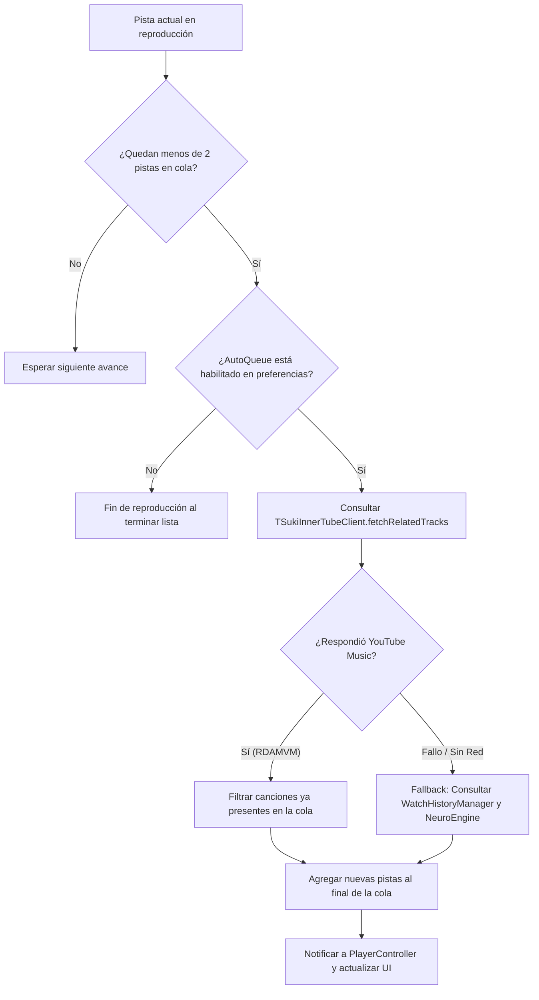

# 04 - AutoQueue y Radio Automix

> **Ubicación:** `app/src/main/java/com/example/tsuki/playback/AutoQueueHelper.kt`
> **Propósito:** Ofrecer música infinita de forma automática basada en el contexto musical actual.

---

## 📻 Cómo Funciona el Automix de TSuki

Cuando el usuario reproduce una canción individual (desde una búsqueda o enlace compartido), o cuando llega al final de una lista de reproducción, TSuki no se detiene en silencio.

`AutoQueueHelper` implementa la siguiente estrategia:

---

## 🔍 Fuentes de Recomendación

1. **Endpoint `next` de InnerTube con Radio Automix (`RDAMVM`)**:
   YouTube Music genera una lista dinámica basada en el video actual mediante el identificador de radio `RDAMVM<videoId>`. Esta lista contiene los temas más afines en tempo, género y época.
2. **Deduplicación Estricta**:
   Antes de añadir las pistas devueltas a la cola, se comparan con las pistas existentes en `state.queue`. Cualquier canción que ya haya sonado o esté en espera es descartada para evitar bucles repetitivos.
3. **Resguardo de Carga Múltiple**:
   La variable `autoQueueAttemptedForIndex` registra el índice exacto para el que se intentó la extensión. Si la red responde con lentitud, se previene que se lancen múltiples llamadas paralelas redundantes.
