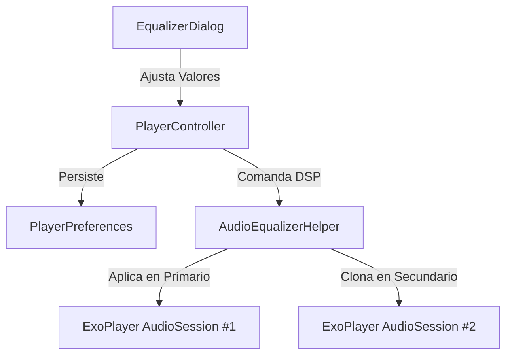

# 03.05 — Ecualizador DSP y Efectos de Audio

> Ficha cerebro TSuki — fuente única de verdad para cualquier IA o ingeniero.
> Responde: QUÉ hace, PARA QUÉ, POR QUÉ está ahí, QUÉ NO TOCAR, CÓMO se trabaja.

---

## 1. QUÉ hace
Encapsula y gobierna los procesadores de señal digital (DSP) nativos de Android a través de `playback/AudioEqualizerHelper.kt`:
- **`Equalizer`**: Ecualizador gráfico multibanda (habitualmente 5 a 10 bandas según el chip de audio del dispositivo). Permite consultar frecuencias centrales en mHz, rangos de ganancia (-1500 a +1500 mB) y aplicar presets predefinidos ("Rock", "Pop", "Jazz", "Clásica", "Bass Boost", "Vocal", etc.).
- **`BassBoost`**: Refuerzo acústico de bajas frecuencias regulable en una escala de 0 a 1000 milésimas de fuerza.
- **`Virtualizer`**: Efecto envolvente 3D para auriculares regulable en una escala de 0 a 1000 milésimas de fuerza.
- **`LoudnessEnhancer`**: Normalizador de volumen y ganancia de salida en miliBelios (0 a 1500 mB, equivalente a hasta +15 dB).
- **Gestión Dual para Crossfade**: Mantiene dos pares de efectos sincronizados: el par primario asociado al `audioSessionId` del `ExoPlayer` principal y el par secundario asociado al `audioSessionId` del `ExoPlayer` de crossfade (`initSecondaryAudioEffects`, `releaseSecondaryAudioEffects`).

**Archivos fuente clave:**
- [`playback/AudioEqualizerHelper.kt:L19-259`](file:///home/sebaxxfxz/Documentos/TSuki/app/src/main/java/com/example/tsuki/playback/AudioEqualizerHelper.kt#L19-L259)
- [`ui/player/EqualizerDialog.kt:L1-533`](file:///home/sebaxxfxz/Documentos/TSuki/app/src/main/java/com/example/tsuki/ui/player/EqualizerDialog.kt#L1-L533)
- [`data/local/PlayerPreferences.kt`](file:///home/sebaxxfxz/Documentos/TSuki/app/src/main/java/com/example/tsuki/data/local/PlayerPreferences.kt)

---

## 2. PARA QUÉ existe (problema que resuelve)
Resuelve dos problemas críticos:
1. Permite al usuario personalizar la respuesta acústica según sus auriculares o altavoces.
2. Evita la rotura tímbrica durante el crossfade: si el reproductor secundario no tuviera sus propios efectos DSP duplicados, la canción entrante sonaría plana durante el fundido y cambiaría bruscamente de color tímbrico al completarse el handoff.

---

## 3. POR QUÉ está en ese lugar (justificación de paquete)
Pertenece a `playback/` porque se acopla directamente a los `audioSessionId` de las instancias de `ExoPlayer` gestionadas por el servicio de reproducción.

---

## 4. QUÉ NO SE DEBE TOCAR JAMÁS (zona roja)
- **Clamping de Valores**:
  - `bassBoostStrength.coerceIn(0, 1000)` (L180).
  - `virtualizerStrength.coerceIn(0, 1000)` (L193).
  - `loudnessGainMb.coerceIn(0, 1500)` (L206). Pasar valores superiores causa distorsión digital o excepciones del driver HAL de Android.
- **Liberación de Sesiones**: En `release()`, se debe liberar obligatoriamente cada efecto mediante `.release()`. Omitirlo causa fugas de sesión de audio en el servidor `audioserver` de Android hasta agotar los recursos del sistema.

---

## 5. CÓMO se ha estado trabajando aquí (convenciones reales)
- Las preferencias de ecualización se persisten atómicamente en `PlayerPreferences` y se re-aplican de inmediato ante cualquier cambio de `audioSessionId`.

---

## 6. Flujo y conexiones

- Enlaces del cerebro: [[02 - Dual-ExoPlayer Crossfade y Handoff]], [[13 - EqualizerDialog 5 Bandas]].

---

## 7. Guía rápida para una IA nueva
- Para consultar o modificar los valores del ecualizador, utiliza `AudioEqualizerHelper.getInstance(context)`.
