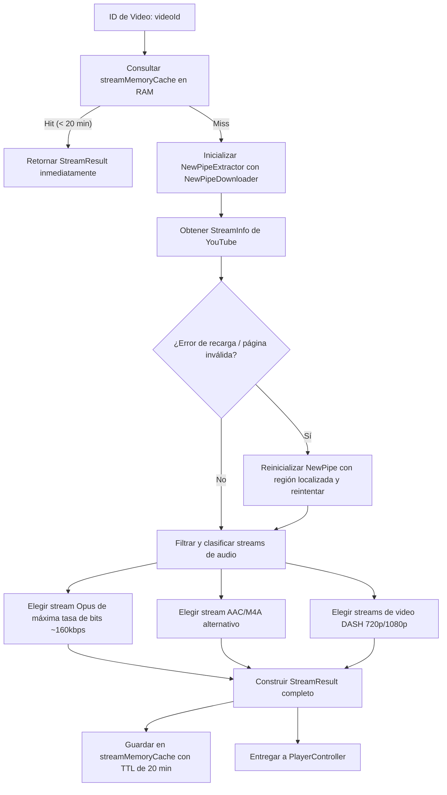

# 02 - YouTubeExtractor, Ciphers y Pipeline de Respaldo

> **Ubicación:** `app/src/main/java/com/example/tsuki/network/YouTubeExtractor.kt`
> **Propósito:** Resolución de URLs directas de streaming de audio y video, descifrado de ciphers y fallback a NewPipe.

---

## 🎯 El Desafío de Extraer Audio de YouTube

YouTube no sirve archivos MP3 simples. Utiliza:
1. **Streams Adaptativos:** Audio y video separados en contenedores WebM/Opus e ISO-BMFF/M4A.
2. **Firmas Cifradas (*Signature Ciphers*):** Algoritmos de JavaScript ofuscados que alteran la URL del stream para impedir reproductores externos sin descifrado en tiempo real.
3. **Restricciones Geográficas y de Región:** URLs que cambian según el país e IP.

---

## 🛠️ Pipeline de Extracción de TSuki



---

## 📊 Formato del Objeto `StreamResult`

```kotlin
data class StreamResult(
    val audioUrl: String?,
    val videoUrl: String?,
    val progressiveVideoUrl: String? = null,
    val aacAudioUrl: String? = null,
    val audioBitrate: Int = 0,
    val audioCodecLabel: String? = null,
    val videoQuality: String? = null,
    val availableQualities: List<QualityOption> = emptyList(),
    val availableAudioTracks: List<AudioTrackOption> = emptyList(),
    val selectedAudioTrack: String? = null,
    val channelAvatarUrl: String? = null,
    val channelId: String? = null,
    val uploaderName: String? = null,
    val title: String? = null,
    val thumbnailUrl: String? = null,
    val durationMs: Long = 0L
)
```

### Por qué `title`, `thumbnailUrl` y `durationMs` se guardan aquí:
Cuando el usuario comparte un enlace externo de YouTube o reproduce desde un deep link, la app solo tiene el `videoId`. Al resolver el stream, `YouTubeExtractor` rescata automáticamente los metadatos completos y la duración exacta para que la interfaz muestre el título y carátula reales sin esperar a una segunda llamada.
