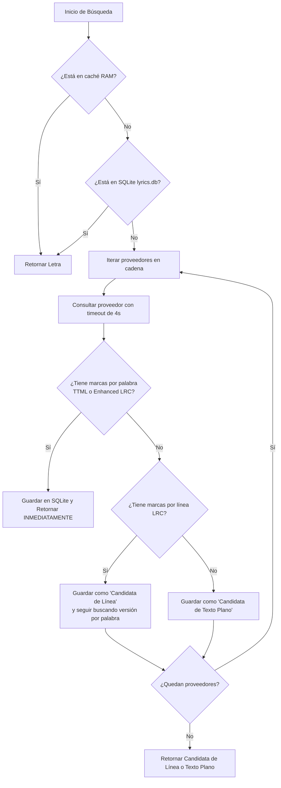

# 01 - Orquestador y los 16 Proveedores de Letras

> **Ubicación:** `app/src/main/java/com/example/tsuki/lyrics/LyricsHelper.kt`
> **Caché:** LRU en memoria (24 elementos) + SQLite persistente en `LyricsDatabase` (1,500 canciones)
> **Propósito:** Cascada multi-proveedor para obtener letras sincronizadas palabra por palabra.

---

## 🎤 La Cadena de Prioridad de los 16 Proveedores

`LyricsHelper` recorre los proveedores en un orden estricto optimizado para calidad y velocidad:

1. **Paxsenix Apple Music:** (`PaxsenixAppleMusicLyricsProvider`) — Letras oficiales con marcas TTML de Apple Music (calidad de estudio silábica).
2. **Paxsenix Spotify:** (`PaxsenixSpotifyLyricsProvider`) — Letras oficiales de Musixmatch servidas por el backend de Spotify.
3. **Paxsenix Musixmatch:** (`PaxsenixMusixmatchLyricsProvider`) — Extracción directa de Musixmatch.
4. **Unison:** (`UnisonLyricsProvider`) — Proveedor sincronizado de alta precisión.
5. **SimpMusic:** (`SimpMusicLyricsProvider`) — Letras de la base de datos de SimpMusic.
6. **YouLyPlus:** (`YouLyPlusLyricsProvider`) — Backend de letras enriquecidas.
7. **Paxsenix General:** (`PaxsenixLyricsProvider`) — Fallback multicanal de Paxsenix.
8. **BetterLyrics:** (`BetterLyricsProvider`) — Base de datos comunitaria de letras sincronizadas avanzadas.
9. **BetterLyrics Portato:** (`BetterLyricsPortatoProvider`) — Nodo espejo de alta velocidad de BetterLyrics.
10. **Paxsenix Netease:** (`PaxsenixNeteaseLyricsProvider`) — Letras asiáticas con marcas milimétricas.
11. **LrcLib:** (`LrcLibLyricsProvider`) — Base de datos libre abierta impulsada por la comunidad.
12. **KuGou:** (`KuGouLyricsProvider`) — Base de datos china especializada en J-Pop, K-Pop y anime.
13. **Netease:** (`NeteaseLyricsProvider`) — Servicio oficial de letras de NetEase Cloud Music.
14. **Megalobiz:** (`MegalobizLyricsProvider`) — Repositorio de archivos LRC sincronizados por línea.
15. **YouTube Subtitles:** (`YouTubeSubtitleLyricsProvider`) — Subtítulos transcritos y alineados de YouTube convertidos a formato lírico.
16. **YouTube Lyrics:** (`YouTubeLyricsProvider`) — Pestaña de letras oficial de YouTube Music (usualmente texto plano no sincronizado).

---

## 🏆 Algoritmo de Aceptación por Calidad

Si ningún proveedor entrega letras palabra por palabra, se utiliza la mejor versión por línea obtenida. Si tampoco hay líneas sincronizadas, se sirve texto plano.
