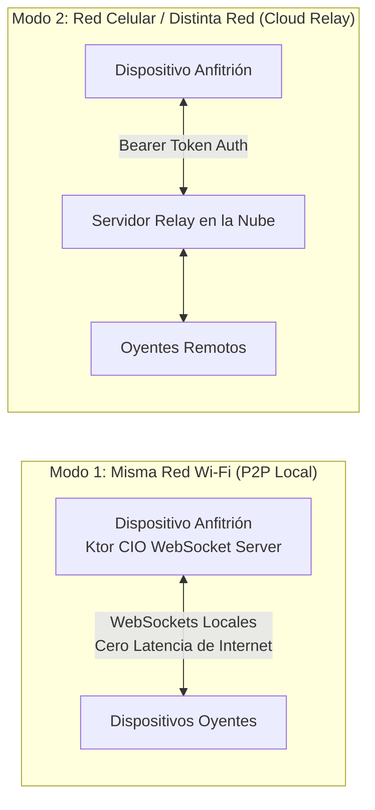

# 01 - Protocolo Híbrido LAN y Cloud Relay (Escuchar Juntos)

> **Ubicación:** `app/src/main/java/com/example/tsuki/together/`
> **Archivos clave:** `TogetherServer.kt`, `TogetherClient.kt`, `TogetherOnlineHost.kt`, `TogetherMessages.kt`
> **Propósito:** Sincronización de música compartida en tiempo real entre múltiples dispositivos.

---

## 👥 Dos Modos de Conexión: LAN vs Cloud

TSuki ofrece una solución de escucha sincronizada que funciona en cualquier entorno:

---

## ⚡ Servidor Ktor CIO Embebido en Android

En modo LAN, el dispositivo anfitrión levanta un servidor HTTP y WebSocket local completo utilizando **Ktor CIO**:
- **Cero dependencias externas:** No requiere que el usuario tenga servidores ni pague suscripciones.
- **Descubrimiento y Enlace:** Genera un enlace profundo `tsuki://together?host=<ip>&port=<port>&session=<key>`. Al hacer clic en el enlace desde WhatsApp o Telegram, el teléfono del amigo abre TSuki y se conecta directamente al anfitrión.

---

## ✉️ Mensajería JSON Tipada (`TogetherMessages.kt`)

Toda la comunicación ocurre mediante marcos de texto WebSocket que transportan paquetes JSON serializados con `kotlinx.serialization`:
* `JoinRequest` / `JoinApproved`: Validación de acceso a la sala.
* `TogetherRoomState`: Estado actual del anfitrión (pista activa, posición en ms, si está reproduciendo, hash de la cola).
* `ControlRequest`: Solicitudes de oyentes para pausar, reanudar o cambiar de pista (si el anfitrión concedió permisos de control).
* `AddTrackRequest`: Permitir a cualquier participante enviar canciones a la cola compartida.
