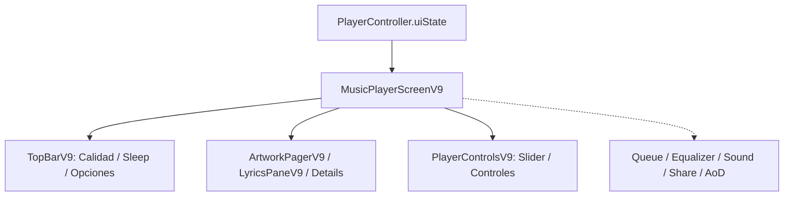

# 11.05 — MusicPlayerScreenV9 (Orquestador 1466L)

> Ficha cerebro TSuki — fuente única de verdad para cualquier IA o ingeniero.
> Responde: QUÉ hace, PARA QUÉ, POR QUÉ está ahí, QUÉ NO TOCAR, CÓMO se trabaja.

---

## 1. QUÉ hace
Orquestador maestro del reproductor a pantalla completa (`ui/player/MusicPlayerScreenV9.kt`, 1466 líneas). Coordina de manera centralizada todos los subsistemas visuales y de interacción del reproductor:
- **Pestañas Principales (`selectedTab: 0, 1, 2`)**:
  - Tab 0: Carátula interactiva (`ArtworkPagerV9`) con Canvas de video looping opcional.
  - Tab 1: Panel de letras sincronizadas y karaoke (`LyricsPaneV9`).
  - Tab 2: Pistas relacionadas, créditos del tema y detalles técnicos del codec.
- **TopBar Inteligente (L746)**: Botón de minimizar, selector de salida de audio, indicador de calidad de transmisión y menú de opciones rápidas.
- **Gestión Centralizada de Modales y Hojas Inferiores**:
  - `showQueueSheet` (L132): Cola de reproducción con reordenamiento y swipe-to-dismiss.
  - `showEqualizerDialog` (L135): Ecualizador de 5 bandas y efectos de sonido.
  - `showSoundSheet` (L1084): Configuración de velocidad, tono, temporizador de apagado y balance estéreo.
  - `showAddToPlaylistSheet`: Guardar la canción en playlists locales o en YouTube Music.
  - `showTagSongSheet`: Editor de etiquetas y géneros personalizados.
  - `showShareCard` (L137): Exportación de tarjeta visual para redes.
  - `showAodScreen`: Modo Always-on-Display minimalista para pantallas OLED.
- **Sincronización de Favoritos y Me Gusta (L163)**: Acción dual que persiste el like localmente en `FavoritesManager` y, si la cuenta de YTM está sincronizada, envía la llamada a InnerTube (`likeEndpoint`).
- **Estado de Descargas Reactivo (L150)**: `remember(track.id)` que observa `DownloadEngine` para reflejar en tiempo real si la canción está descargada, descargando o pendiente.

**Archivos fuente clave:**
- [`ui/player/MusicPlayerScreenV9.kt:L1-1466`](file:///home/sebaxxfxz/Documentos/TSuki/app/src/main/java/com/example/tsuki/ui/player/MusicPlayerScreenV9.kt#L1-L1466)
- [`playback/PlayerController.kt`](file:///home/sebaxxfxz/Documentos/TSuki/app/src/main/java/com/example/tsuki/playback/PlayerController.kt)

---

## 2. PARA QUÉ existe (problema que resuelve)
Centraliza todo el flujo del reproductor en un único andamio robusto. Sin este orquestador central, cada hoja o diálogo tendría que consultar y mutar estados de forma fragmentada, provocando inconsistencias críticas (ej. marcar favorito en la cola y que no se actualice en la pantalla principal).

---

## 3. POR QUÉ está en ese lugar (justificación de paquete)
Reside en `ui/player/` como la cúspide de la jerarquía visual de reproducción musical en TSuki.

---

## 4. QUÉ NO SE DEBE TOCAR JAMÁS (zona roja)
- **`remember(track.id)` de Descargas (L150)**: Debe estar estrictamente anclado al ID de la pista para evitar disparar consultas continuas a la base de datos de descargas en cada tick de la barra de reproducción.
- **Sincronización de Favoritos (L163)**: No desacoplar la persistencia local de la llamada a InnerTube; ambas deben ejecutarse en concurrencia estructurada.
- **`SoundSheetRow/Card` Reutilizable (L1084)**: Componentes públicos consumidos por otros diálogos; no renombrar ni alterar su firma pública.

---

## 5. CÓMO se ha estado trabajando aquí (convenciones reales)
- Contenedores modales agrupados con esquinas redondeadas de `24dp` y fondo `MaterialTheme.colorScheme.surfaceContainerHigh`.
- Botones de acción envueltos en `FilledTonalIconButton` de tamaño `36dp` a `40dp`.
- Modificaciones atómicas con diffs mínimos sin reescribir bloques grandes de código.

---

## 6. Flujo y conexiones

- Subcomponentes: [[06 - PlayerControlsV9 Pastillas y Slider]], [[07 - ArtworkPagerV9 Gestos y Canvas]], [[09 - QueueListV9 Reorder Swipe Undo]].

---

## 7. Guía rápida para una IA nueva
- Para añadir una nueva opción al menú contextual del reproductor, agrégala en `TopBarV9` o en las acciones rápidas debajo de los controles principales.
- Respeta la regla de oro: Cero comentarios en el código Kotlin.
